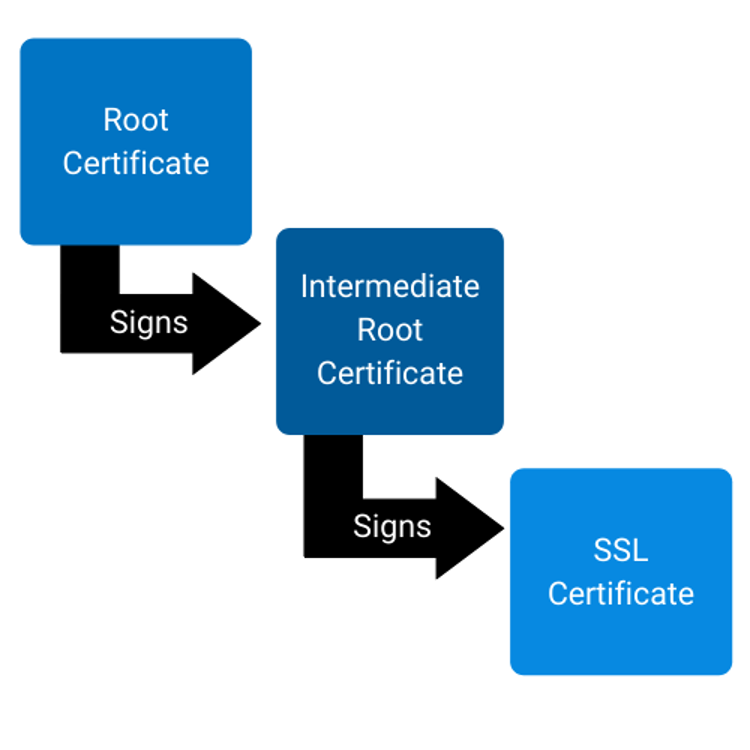

# What is a Certificate Authority (CA)?

* A certificate authority (CA) is a trusted third party.
* A self-signed certificate that signs other certificates establishing a chain
  of trust.
* Systems that trust the CA certifiate will trust all certificates signed by it.

# What is the Difference Between a Root and Intermediate CA?


Image Credit: [DigiCert Blog, 2020-06-11](https://www.digicert.com/blog/impacts-of-root-certificate-expiration/#:~:text=Certificate%20authorities%20(CAs)%20adhere%20to,prepare%20for%20when%20they%20expire.)

# Root Certificate Authorities

* First link in the "trust chain".
  * A compromised Root CA, compromises the trust of all certificates behind it.
* Are typically used to sign Intermediate CAs.
  * Allows for stronger protection of the Root CA Certificate by delegating its
    trust to the Intermediate CA to sign certificates.
* Typically have long validity periods.
  * Usually 10 or 20 years.
  * Root CAs cannot sign Intermediate CAs for validity periods longer than their
    own.

# Intermediate Certificate Authorities

* Intermediate CAs are typically used to sign TLS Certificates.
* Intermediate CAs cannot be trusted without trusting the Root CA.
* A compromised Intermediate CA Certificate:
  * only compromises the trust of the certificates it signed.  
  * does not impact the trust of certificates signed by other Intermediate CAs 
    signed by the same Root CA.
* Typically have long validity periods.
  * Usually valid for half as long as the Issuing Root CA. Around 5-10 years.
  * Intermediate CAs cannot sign TLS Certificates for validity periods longer
    than their own.

# Validity Period Standard Practices

* Root and Intermediate CAs should renew their certificate values at half of
  their validity periods.
  * Ensures the same key pair is never used for a period longer than the
    intended original validity peropd.
  * Ensures the remaining validity period of the Issuing CA does not affect the
    validity of issued certificates.

| Certificate Type            | Validity Period | Renew At  |
| --------------------------- | --------------- | --------- |
| Root CA Certificate         | 20 years        | 10 years  |
| Intermediate CA Certificate | 10 years        | 5 years   |
| Issued TLS Certificate      | 5 years         | 2.5 years |

# Validity Period Suggested Practices

* Shortening the validity periods with automation enables Root CA Certificate
  to be reactive to changes in certificate standards.

| Certificate Type            | Validity Period | Renew At  |
| --------------------------- | --------------- | ----------- |
| Root CA Certificate         | 5 years         | 2.5 years   |
| Intermediate CA Certificate | 2 years         | 1 years   |
| Issued TLS Certificate      | 1 years         | .5 years   |

# Why not use LetsEncrypt for Peer TLS Certificates?

* etcd cluster would trust peers with any valid LetsEncrypt certificate.
* etcd peers are authenticated by certificate trust.
* Any host on the Internet could become a trusted peer.

# Why not use LetsEncrypt for Client TLS Certificates?

* etcd cluster would trust peers with any valid LetsEncrypt certificate.
* etcd clients are authenticated by certificate trust.
* etcd clients are mapped to users by the certificate's Common Name (CN)
* Any host on the Internet could become the root user.

# Install openssl and cfssl

* Install cfssl

  ```bash
  # update package cache
  sudo apt update

  # Install openssl and golang-cfssl packages.
  sudo apt install -y openssl golang-cfssl
  ```

# Create Root CA Certificate

NOTE: update paths from ~ to something better in final version.

* Create directory structure

  ```bash
  mkdir -p ~/certificate_authority
  mkdir -p ~/certificate_authority/ca
  mkdir -p ~/certificate_authority/intermediate
  mkdir -p ~/certificate_authority/intermediate/cluster
  mkdir -p ~/certificate_authority/intermediate/development
  mkdir -p ~/certificate_authority/certs
  ```

* Create a Root CA Certificate CSR
  ~/certificate_authority/ca/ca-sr.json

  ```json
  {
    "CN": "Ryezone Labs CA",
    "key": {
        "algo": "rsa",
        "size": 4096
    },
    "names": [
        {
               "C": "US",
               "L": "Bloomington",
               "O": "Ryezone Labs",
               "ST": "Minnesota"
        }
    ]
  }
  ```

* Generate Root CA Certificate

```bash
cfssl gencert -initca certificate_authority/ca/ca-sr.json \
  | cfssljson -bare certificate_authority/ca
```

# Create Intermediate Certificate Authorities

* Create Intermediate CSR JSON files


* Create an Intermediate CA Certificate CSR

  ```json
  {
    "signing": {
      "default": {
          "expiry": "43800h"
      },
      "profiles": {
        "etcd": {
          "usages": [
              "signing",
              "key encipherment",
              "cert sign",
              "crl sign",
              "server auth",
              "client auth"
          ],
          "ca_constraint": {
            "is_ca": true
          }
        },
        "kubernetes": {
          "usages": [
              "signing",
              "key encipherment",
              "cert sign",
              "crl sign",
              "server auth",
              "client auth"
          ],
          "ca_constraint": {
            "is_ca": true
          }
        },
        "development": {
          "usages": [
            "signing",
            "key encipherment",
            "cert sign",
            "crl sign"
          ],
          "ca_constraint": {
            "is_ca": true
          }
        }
      }
    }
  }
  ```

* Create the Intermediate Certificates

  ```bash
  ```

# References

* [Certificate Authority with CFSSL](https://jite.eu/2019/2/6/ca-with-cfssl/)
* [The Impact of a Root Certificate Expiration](https://www.digicert.com/blog/impacts-of-root-certificate-expiration/#:~:text=Certificate%20authorities%20(CAs)%20adhere%20to,prepare%20for%20when%20they%20expire.)
* [CA Validity Period Extension and CA Certificate Renewal Process](https://www.experts-exchange.com/articles/32336/CA-Validity-Period-Extension-and-CA-Certificate-Renewal-Process.html)
* [Determining Certificate Validity Periods](https://www.serverbrain.org/certificate-security-2003/determining-certificate-validity-periods.html)
