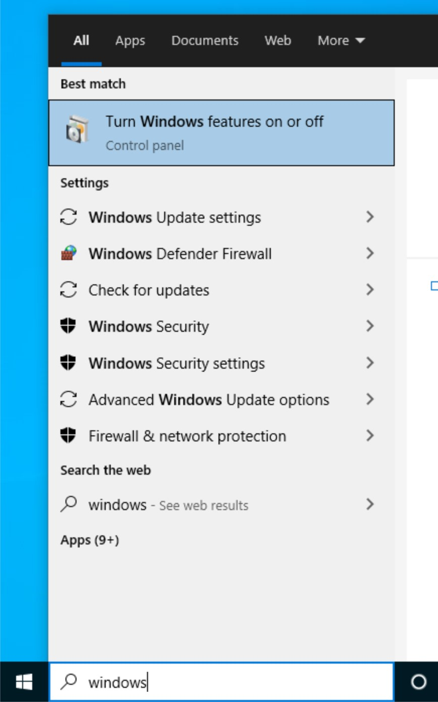
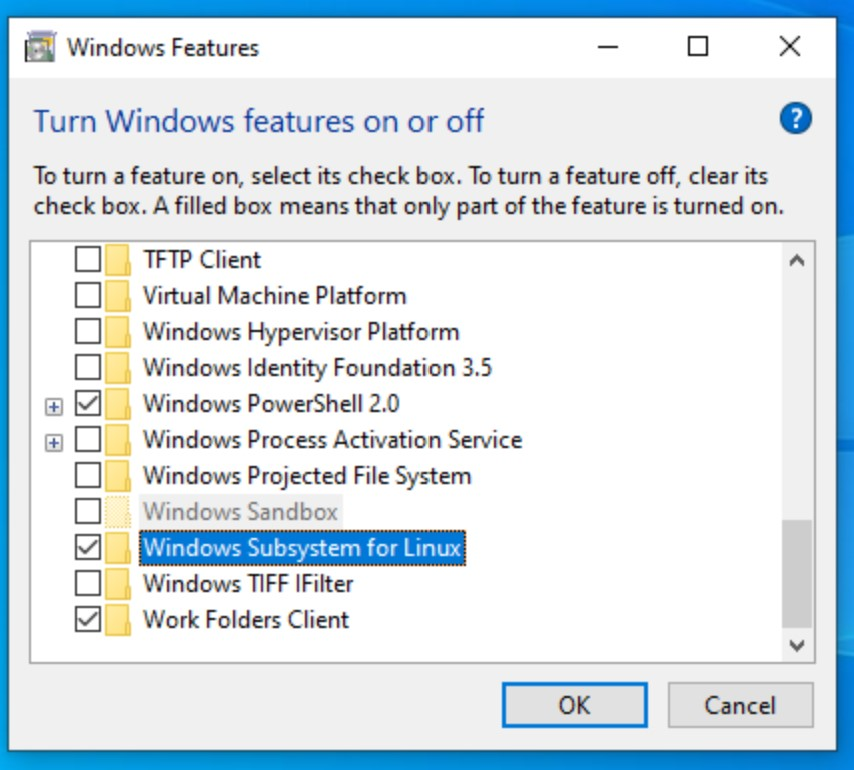
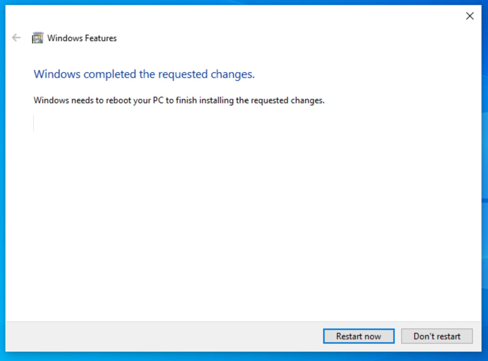

# Setting up the Lab in Windows

## Install WSL 2

1. Click the start menu.  Search for `Windows features`.

    

1. Click `Turn Windows features on or off`

1. Scroll until you find the `Containers` feature.

1. Ensure the box is checked.  This means the feature is installed.

1. Scroll down until you find the `Windows Subsystem for Linux` feature.

1. Ensure the box is checked.  This means the feature is installed.

    

1. Click Ok.

1. Click Restart.

    

1. Install Ubuntu 20.04 for WSL.  [See instructions here.](https://ubuntu.com/wsl)

1. Launch Ubuntu for WSL

## Install Windows Terminal

1. Download latest stable release from [here](https://github.com/microsoft/terminal/releases)

1. Install the msixbundle.

## Install Visual Studio Code

1. Download the latest stable user installer from [here](https://code.visualstudio.com/Download).

1. Run the installer.

1. Install the recommended WSL extension.

## Install Docker Desktop for Windows

1. Ensure Virtualization Support is enabled in the BIOS

1. Download the latest installer from [here](https://www.docker.com/products/docker-desktop)

1. Run the installer.

1. Download the [WSL2 kernel](https://wslstorestorage.blob.core.windows.net/wslblob/wsl_update_x64.msi).

1. Run the WSL 2 Kernel installer.

1. Set WSL 2 as default version

    ```powershell
    wsl --set-default-version 2
    wsl --set-version Ubuntu 2
    ```

1. Restart Docker

## Configure Ubuntu for WSL 2

TODO: Work in Progress.
