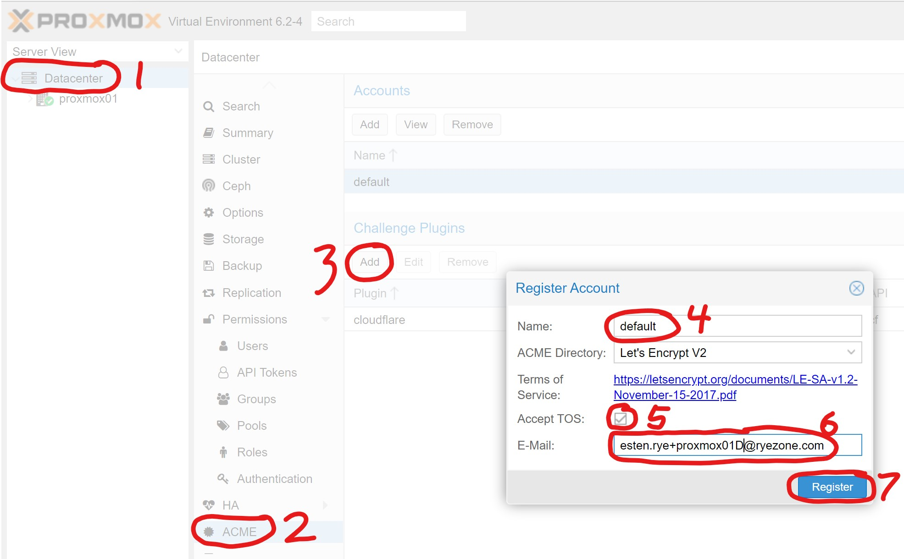
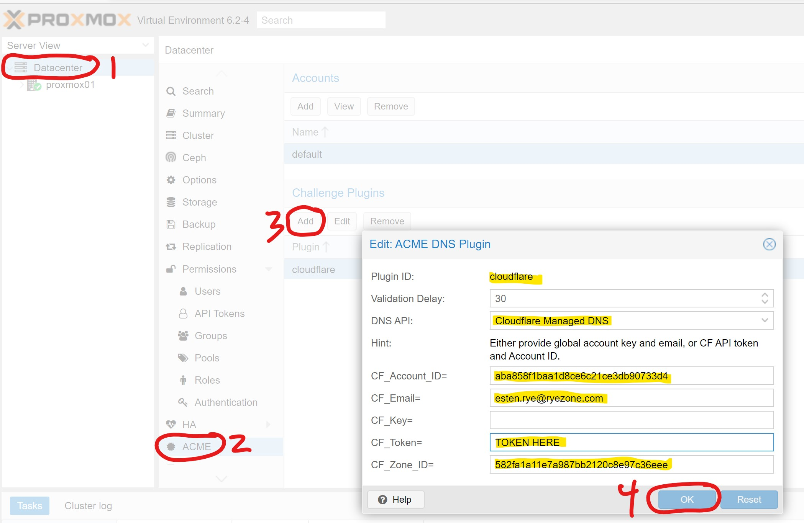
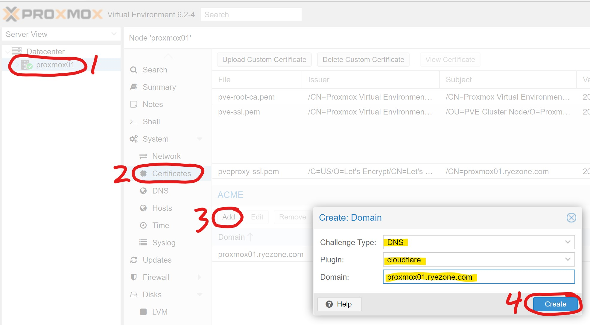
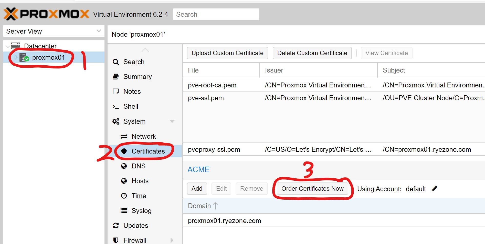

# Proxmox

- [Proxmox VE Wiki](https://pve.proxmox.com/wiki/)
- [Proxmox Suport Forum](https://forum.proxmox.com/)
- [Proxmox Bug Tracker](https://bugzilla.proxmox.com/)
- Ansible Roles
  - lae.proxmox
    - [ansible-galaxy](https://galaxy.ansible.com/lae/proxmox)
    - [github](https://github.com/lae/ansible-role-proxmox)
- Terraform Provider
  - [github](https://github.com/Telmate/terraform-provider-proxmox)
- [Docker Machine Driver for Proxmox VE](https://github.com/lnxbil/docker-machine-driver-proxmox-ve)

## Configure Network with vlan

```conf
iface eno1 inet manual
# MANAGEMENT

auto eno1.61
iface eno1.61 inet manual
vlan_raw_device eno1

auto vmbr0
iface vmbr0 inet static
	address 10.5.10.1
	netmask 255.255.255.0
	gateway 10.5.0.1
	bridge_ports eno1.61
        bridge_vlan_aware yes
	bridge_stp off
	bridge_fd 0
```

## Configure ACME LetsEncrypt









## JumpCloud LDAP Configuration

Need to document this.

## Next Steps

- Automated Updates
- Subscription?
- Figure out how to attach iSCSI mounts to FreeNAS
- Figure out how to build cluster.
- Figure out how to configure acme with the CLI/API
- Ansible automation for networking?